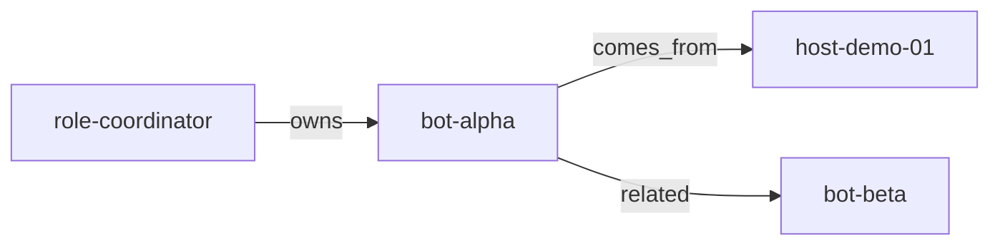

> 🌐 **English** (this file) · [**Español**](README.md)

# agent-context-atlas

[](https://github.com/Rentheria/agent-context-atlas/actions/workflows/ci.yml)
[](https://github.com/Rentheria/agent-context-atlas/actions/workflows/ci.yml)
[](LICENSE)
<!-- [](https://www.npmjs.com/package/agent-context-atlas) -->

Wiki + typed doc graph + hybrid RAG for **agent/machine context**.  
Not a spend tracker.

**Owner:** Alejandro Rentheria ([Rentheria](https://github.com/Rentheria)). Portfolio product, MIT.

## What this is (and is not)

This product is a **public toolkit**: a synthetic context wiki + typed doc graph + RAG. Demo fiches (`host-demo-01`, `bot-alpha`, `org-example`, …) exist so an agent can **quote the corpus** or answer exactly `falta el dato`.

It is **not** a private operations inventory index. It is **not** a personal notes vault. This repository does not name third-party private systems or teammate nicknames.

Public roadmap: [ROADMAP.md](ROADMAP.md).

## TL;DR

Markdown fiches (one per machine/role/bot) + typed edges + incremental embeddings + `atlas query`. If a metric is not in the corpus, the answer is exactly **`falta el dato`**. Synthetic fixtures only.

## MVP

1. **Markdown fiches** (one file per machine/role/bot) + **typed document graph** with edges `comes_from` | `leads_to` | `related` | `owns`. Readable markdown navigation is a **view** of the graph, not a second source of truth.
2. **Hybrid RAG:** chunk docs + incremental embeddings (re-embed only when `content_hash` changes) + expand graph neighbors on query. Ingest embeddings via OpenAI-compatible `POST /v1/embeddings` (local or cloud). **No API keys in the repo**; use environment variables.
3. **Query CLI** (and a thin library API) that **never invents measured numbers**. If a metric is not in the corpus, answer exactly: `falta el dato`.

## Policy: synthetic fixtures only

This repository includes **zero** private infra from any real deployment: no real host/boot/provisioning names, private IPs, credentials, inventories, teammate nicknames, or anything that fingerprints private infrastructure.

Demo ids only: `host-demo-01`, `bot-alpha`, `role-coordinator`, `bot-beta`, `role-operator`, `org-example`.

## Quickstart

Requires Node ≥ 20.

```bash
git clone https://github.com/Rentheria/agent-context-atlas.git
cd agent-context-atlas
npm install
npm run build
npx atlas ingest --mock --fiches fixtures/fiches --graph fixtures/graph.json
npx atlas query --mock "RAM_GB de host-demo-01"
npx atlas query --mock "latencia de bot-alpha"
npx atlas query --mock --json "latencia de bot-alpha"
```

`--mock` uses deterministic embeddings **offline** (no API key). The second query should print exactly `falta el dato` (that metric is not in the fiches). Ingest and query must both use `--mock`.

Live embeddings (OpenAI-compatible): `cp .env.example .env`, fill URL/model/key, and omit `--mock`. If the target is the cloud (default OpenAI) and the key is missing, the CLI fails with a bilingual, actionable message — **never** a raw OpenAI 401.

Without building:

```bash
npm run atlas -- ingest --mock
npm run atlas -- query --mock "max_context_tokens of bot-alpha"
```

Local index: `.atlas/` (gitignored). Ingest writes `.atlas/NAV.md` (markdown nav + Mermaid fence) and `.atlas/GRAPH.mmd` (the same typed graph). No embeddings:

```bash
npx atlas doctor --fiches fixtures/fiches --graph fixtures/graph.json
npx atlas doctor --json --fiches fixtures/fiches --graph fixtures/graph.json
npx atlas graph --format mermaid
npx atlas graph --format mermaid --out examples/graph.mmd
npx atlas graph --format dot
```

`doctor --json` prints a stable object: `{ ok, ficheCount, ficheIds, edgeCount, danglingEdges, orphans, guardHits }`. `danglingEdges` is `{ from, to, type }[]`; `guardHits` is `{ kind, excerpt }[]`. The command is unchanged. `--out` writes mermaid|dot to the file and **still** prints to stdout.

Mermaid view of the fixture typed edges (synthetic ids):



Hit vs miss: [examples/hit-vs-falta.md](examples/hit-vs-falta.md). Full graph: [examples/graph.mmd](examples/graph.mmd).

## Environment variables

| Variable | Meaning |
| --- | --- |
| `ATLAS_EMBEDDINGS_BASE_URL` | OpenAI-compatible base. Default: `https://api.openai.com/v1`. Local example: `http://localhost:11434/v1`. |
| `ATLAS_EMBEDDINGS_MODEL` | Embedding model. Default: `text-embedding-3-small`. |
| `ATLAS_EMBEDDINGS_API_KEY` | Required for cloud (OpenAI or any non-local host). Local server: optional. `OPENAI_API_KEY` is also read. |
| `ATLAS_BENCH_MODE` | `npm run bench` only: `mock` (default, no HTTP) or `http` (same embeddings vars). |
| `ATLAS_BENCH_OUT` | Bench only: JSON path (default `bench-results.json`, gitignored). |

Never commit `.env`. The client `POST`s `{baseUrl}/embeddings`.

`npm test`, `atlas ingest --mock` / `atlas query --mock`, and `npm run bench` (default `mock` mode) **do not** call HTTP: no key required. `ATLAS_BENCH_MODE=http` / `--mode http` uses the same embeddings variables.

## Performance

`npm run bench` measures **on this machine** (synthetic corpus; mocked embeddings by default):

- cold ingest: wall time and how many texts were embedded
- **unchanged** re-ingest: time and embed count (`content_hash` reuse should drop embeds to 0 or near 0)
- query p50/p95 latency on a fixed question set, including one that returns `falta el dato`

No timings are published here: they are machine-local and vary with CPU/IO. Run `npm run bench` (optionally writes `bench-results.json`, gitignored). The suite proves incremental reuse and that the query path is measurable — **not** a production SLA.

Synthetic quickstart: [examples/synthetic-quickstart.md](examples/synthetic-quickstart.md). Index: [examples/README.md](examples/README.md).

CI runs `npm run bench -- --ci` (mock smoke). Full local bench is `npm run bench`. Smoke **timing** gates are **soft warnings** (they do not fail CI); the hard fail is `content_hash` reuse plus a `falta el dato` answer. See `npm run bench -- --help`. No timings are published here.

## Library

```ts
import { ingest, query, FALTA_EL_DATO } from "agent-context-atlas";
```

`query()` is extractive: it quotes the corpus or returns `falta el dato`. It does not generate figures.

## Development

```bash
npm test           # Vitest; embeddings HTTP is mocked
npm run test:coverage
npm run typecheck
npm run bench      # synthetic corpus; mock by default
npm run bench:ci   # fast smoke (same as CI)
```

## See also

Portfolio siblings — **spend vs context**:

- [llm-agent-spend-manager](https://github.com/Rentheria/llm-agent-spend-manager) — LLM spend/activity visibility (complementary: spend vs context)
- [cursor-native-agent](https://github.com/Rentheria/cursor-native-agent)
- [chatarmor](https://github.com/Rentheria/chatarmor)
- [llm-budget-cap](https://github.com/Rentheria/llm-budget-cap)

## License

[MIT](LICENSE) © Alejandro Rentheria
