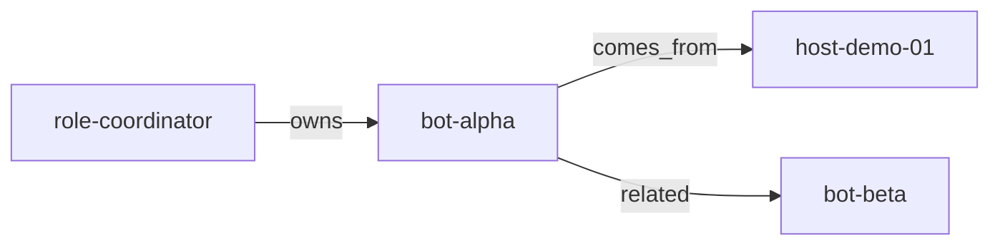

> 🌐 **Español** (este archivo) · [**English**](README.en.md)

# agent-context-atlas

[](https://github.com/Rentheria/agent-context-atlas/actions/workflows/ci.yml)
[](https://github.com/Rentheria/agent-context-atlas/actions/workflows/ci.yml)
[](LICENSE)
<!-- [](https://www.npmjs.com/package/agent-context-atlas) -->

Wiki + grafo tipado + RAG híbrido para **contexto de agentes/máquinas**.  
No es un tracker de gasto.

**Owner:** Alejandro Rentheria ([Rentheria](https://github.com/Rentheria)). Producto de portafolio, MIT.

## Qué es (y qué no es)

Este producto es un **toolkit público** de wiki de contexto sintético + grafo tipado + RAG. Las fichas de demostración (`host-demo-01`, `bot-alpha`, `org-example`, …) existen para que un agente **cite el corpus** o responda exactamente `falta el dato`.

**No** es un índice de inventario de operaciones privadas. **No** es una bóveda de notas personales. Este repositorio no nombra sistemas privados de terceros ni apodos de equipo.

Roadmap público: [ROADMAP.md](ROADMAP.md).

## TL;DR

Fichas Markdown (una por máquina/rol/bot) + grafo con aristas tipadas + embeddings incrementales + `atlas query`. Si una métrica no está en el corpus, la respuesta es exactamente **`falta el dato`**. Solo fixtures sintéticos.

## MVP

1. **Fichas Markdown** (un archivo por máquina/rol/bot) + **grafo de documentos tipado** con aristas `comes_from` | `leads_to` | `related` | `owns`. La navegación Markdown es una **vista** del grafo, no una segunda fuente de verdad.
2. **RAG híbrido:** trocea docs + embeddings incrementales (re-embebe solo si cambia `content_hash`) + expande vecinos del grafo al consultar. Ingiere embeddings vía `POST /v1/embeddings` compatible con OpenAI (local o nube). **Sin API keys en el repo**; solo variables de entorno.
3. **CLI de consulta** (y API de librería delgada) que **nunca inventa números medidos**. Si una métrica no está en el corpus, responde exactamente: `falta el dato`.

## Política: solo fixtures sintéticos

Este repositorio **no** incluye infraestructura privada de ningún despliegue real: nada de nombres reales de host/arranque/aprovisionamiento, IPs privadas, credenciales, inventarios, apodos de equipo ni nada que identifique infraestructura privada.

Solo ids de demostración: `host-demo-01`, `bot-alpha`, `role-coordinator`, `bot-beta`, `role-operator`, `org-example`.

## Quickstart

Requisito: Node ≥ 20.

```bash
git clone https://github.com/Rentheria/agent-context-atlas.git
cd agent-context-atlas
npm install
cp .env.example .env   # rellena URL/modelo/clave en tu máquina
npm run build
npx atlas ingest --fiches fixtures/fiches --graph fixtures/graph.json
npx atlas query "RAM_GB de host-demo-01"
npx atlas query "latencia de bot-alpha"
npx atlas query --json "latencia de bot-alpha"
```

La segunda consulta debe imprimir exactamente `falta el dato` (esa métrica no está en las fichas).

Sin compilar:

```bash
npm run atlas -- ingest
npm run atlas -- query "max_context_tokens of bot-alpha"
```

Índice local: `.atlas/` (gitignored). La ingestión escribe `.atlas/NAV.md` (navegación Markdown + bloque Mermaid) y `.atlas/GRAPH.mmd` (el mismo grafo tipado). Sin embeddings:

```bash
npx atlas doctor --fiches fixtures/fiches --graph fixtures/graph.json
npx atlas graph --format mermaid
npx atlas graph --format dot
```

Vista Mermaid de las aristas tipadas del fixture (ids sintéticos):



Hit vs miss: [examples/hit-vs-falta.md](examples/hit-vs-falta.md). Grafo completo: [examples/graph.mmd](examples/graph.mmd).

## Variables de entorno

| Variable | Qué es |
| --- | --- |
| `ATLAS_EMBEDDINGS_BASE_URL` | Base OpenAI-compatible. Default: `https://api.openai.com/v1`. Para un servidor local: `http://localhost:11434/v1`. |
| `ATLAS_EMBEDDINGS_MODEL` | Modelo de embeddings. Default: `text-embedding-3-small`. |
| `ATLAS_EMBEDDINGS_API_KEY` | Opcional (muchos servidores locales no la piden). También se lee `OPENAI_API_KEY`. |
| `ATLAS_BENCH_MODE` | Solo `npm run bench`: `mock` (default, sin HTTP) o `http` (mismas vars de embeddings). |
| `ATLAS_BENCH_OUT` | Solo bench: ruta del JSON (default `bench-results.json`, gitignored). |

Nunca commitees `.env`. El cliente hace `POST {baseUrl}/embeddings`.

`npm test` y `npm run bench` (modo `mock` por defecto) **no** llaman a HTTP: no hace falta clave. `ATLAS_BENCH_MODE=http` / `--mode http` usa las mismas variables de embeddings.

## Rendimiento

`npm run bench` mide **en esta máquina** (corpus sintético; embeddings mockeados por defecto):

- ingestión en frío: tiempo y cuántos textos se embeben
- re-ingest **sin cambios**: tiempo y embeds (el reuse por `content_hash` debe dejar los embeds en 0 o casi 0)
- latencia p50/p95 de `query` sobre un set fijo de preguntas, incluida una que responde `falta el dato`

No hay cifras publicadas aquí: son locales y cambian con CPU/IO. Ejecuta `npm run bench` (opcionalmente escribe `bench-results.json`, gitignored). El suite demuestra reuse incremental y que el camino de consulta es medible — **no** un SLA de producción.

Quickstart sintético: [examples/synthetic-quickstart.md](examples/synthetic-quickstart.md). Índice: [examples/README.md](examples/README.md).

CI ejecuta `npm run bench -- --ci` (humo mock). El bench local completo es `npm run bench`. Los umbrales de tiempo del smoke son **avisos suaves** (no fallan CI); el fail duro es reuse de `content_hash` + presencia de `falta el dato`. Ver `npm run bench -- --help`. No hay cifras publicadas aquí.

## Librería

```ts
import { ingest, query, FALTA_EL_DATO } from "agent-context-atlas";
```

`query()` es extractivo: cita el corpus o devuelve `falta el dato`. No genera cifras.

## Desarrollo

```bash
npm test           # Vitest; HTTP de embeddings mockeado
npm run test:coverage
npm run typecheck
npm run bench      # corpus sintético; mock por defecto
npm run bench:ci   # humo rápido (mismo que CI)
```

## See also

Complementarios de portafolio — **gasto vs contexto**:

- [llm-agent-spend-manager](https://github.com/Rentheria/llm-agent-spend-manager) — visibilidad de gasto/actividad LLM (complementario: spend vs context)
- [cursor-native-agent](https://github.com/Rentheria/cursor-native-agent)
- [chatarmor](https://github.com/Rentheria/chatarmor)
- [llm-budget-cap](https://github.com/Rentheria/llm-budget-cap)

## Licencia

[MIT](LICENSE) © Alejandro Rentheria
